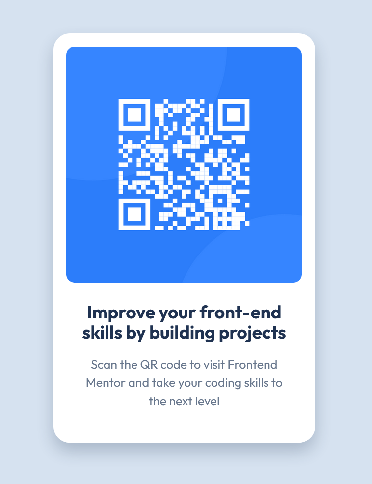

# Frontend Mentor - QR code component solution

This is a solution to the [QR code component challenge on Frontend Mentor](https://www.frontendmentor.io/challenges/qr-code-component-iux_sIO_H). Frontend Mentor challenges help you improve your coding skills by building realistic projects. 

## Table of contents

- [Overview](#overview)
  - [Screenshot](#screenshot)
  - [Links](#links)
- [My process](#my-process)
  - [Built with](#built-with)
  - [What I learned](#what-i-learned)
  - [Continued development](#continued-development)
- [Author](#author)

## Overview

### Screenshot

### Links

- Solution URL: [solution hub on Frontend Mentor](https://www.frontendmentor.io/solutions/qr-code-component-using-flexbox-DdFHdwLO0U)
- Live Site URL: [live site on Vercel](https://qr-code-component-eight-sandy.vercel.app/)

## My process

### Built with

- Semantic HTML5 markup
- CSS custom properties
- Flexbox
- Mobile-first workflow

### What I learned

This straightforward component is the first recommended project from the Getting Started on Frontend Mentor learning path. I love the Frontend Mentor platform and have been enjoying the Building responsive layouts and JavaScript fundamentals paths. Being a completionist at heart, I decided to spend a bit of time working through this entry-level learning path as well. The projects may be quite simple, but I do believe there's value in stepping back every once in a while and revisiting the fundamentals and basic building blocks of a craft. Web development is no different. I enjoyed piecing together this component using a bare minimum of markup and styles and being reminded that trying to be overly clever with solutions can get in the way of creating simple, easy-to-understand code. 

### Continued development

While my current main focus is React and more advanced layout techniques, I'm going to continue to spend time working through this entry-level learning path to brush up on fundamentals. This exercise is also helpful in staying active within the community and providing useful feedback for learners at different stages of development.

## Author

- Website - [Matt Pahuta](https://www.mattpahuta.com)
- Frontend Mentor - [@mattpahuta](https://www.frontendmentor.io/profile/MattPahuta)
- Twitter - [@mattpahuta](https://www.twitter.com/MattPahuta)
- LinkedIn - [Matt Pahuta](www.linkedin.com/in/mattpahuta)

